## p99는 안정적인데 Max만 튀는 현상 - JVM, GC, HikariCP 모니터링을 통한 병목 해결

### 목차
- [성능 테스트 환경](#성능-테스트-환경)
- [시나리오](#시나리오)
- [검증 조건](#검증-조건)
- [증상 및 현상](#증상-및-현상)
- [원인 분석](#원인-분석)
- [해결 방법](#해결-방법)
  - [1. 인덱스 최적화](#1-인덱스-최적화)
  - [2. LiveStreamingChat 테이블 역정규화](#2-livestreamingchat-테이블-역정규화)
  - [3. 쓰기 시점 DB 조회 제거 (채팅 전송 최적화)](#3-쓰기-시점-db-조회-제거-채팅-전송-최적화)
- [커넥션 풀 크기별 성능 테스트](#커넥션-풀-크기별-성능-테스트)
- [결과 및 개선 효과](#결과-및-개선-효과)
- [트러블슈팅 회고](#트러블슈팅-회고)
- [모니터링 스냅샷 (Grafana)](#모니터링-스냅샷-grafana)

---

### 성능 테스트 환경

**테스트 환경**

**테스트 데이터**
- User: 100,000명
- Channel: 100,000개
- Subscription: 2,000,000+ 건
- Push Subscription: 50,000건
- Live Streaming: 1,111개 (LIVE 1개 + ENDED 1,110개)
- Live Streaming Chat: 300,000건

---

### 시나리오
시나리오: 라이브 스트리밍 채팅/통계 폴링 기반 부하 테스트

측정시간: 약 21분
VUser: 총 1000명(회원 700명, 비회원 300명)

**회원 시나리오**
실행 흐름:
1. 사전에 로그인된 상태로 구성 (세션 쿠키)
2. 라이브 스트리밍 메타데이터 조회
3. 초기 채팅 조회
4. pause(1~3초) - 화면 로딩
5. 좋아요/싫어요 반응 (10% 확률로 반응, 그 중 95% 좋아요, 5% 싫어요)
6. 세션 지속시간동안 폴링 및 채팅 전송 (채팅 전송: 확률 기반, 통계: 20초마다, 채팅: 4초마다)

**비회원 시나리오**
실행 흐름:
1. 라이브 스트리밍 메타데이터 조회
2. 초기 채팅 조회
3. pause(1~3초) - 화면 로딩
4. 세션 지속동안 폴링 (통계: 20초마다, 채팅: 4초마다)

---

### 검증 조건
**검증 조건 (응답시간 기준)**

| API | p95 | p99 |
|-----|-----|-----|
| 메타데이터 조회 | ≤ 300ms | ≤ 600ms |
| 초기 채팅 조회 | ≤ 500ms | ≤ 1000ms |
| 새 채팅 폴링 | ≤ 400ms | ≤ 700ms |
| 실시간 통계 폴링 + Heartbeat | ≤ 700ms | ≤ 1200ms |
| 좋아요/싫어요 반응 | ≤ 600ms | ≤ 1200ms |

---

### 증상 및 현상

**관측된 지표**

**Gatling 성능테스트 응답시간 통계**
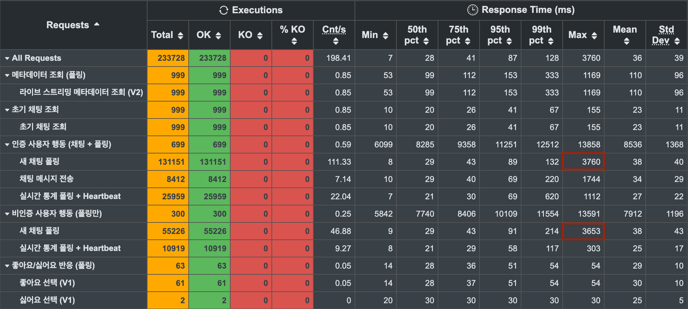
- 전반적인 p95/p99는 안정적이지만, '새 채팅 폴링'에서 최대 응답시간(max)가 3~4초 수준으로 간헐적 스파이크 발생

**GC Pause Durations**
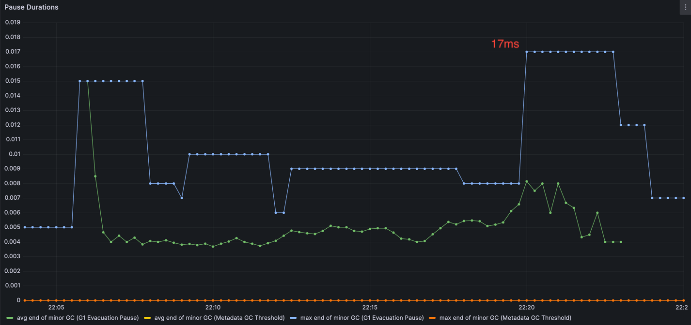
- GC pause 최댓값이 17ms(0.017) 이므로 3~4초의 Stop The World는 아니다.

> 초록색: 최근 1분 동안 발생한 GC pause들의 평균 1회당 pause 시간  
> 파란색: 구간안에서 관측된 pause의 최댓값

**Tomcat Thread**
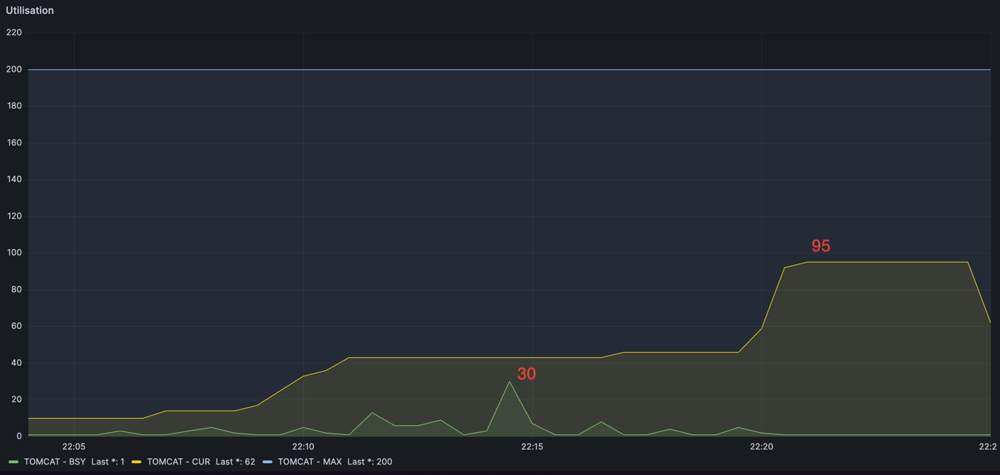

- MAX는 200, CUR은 100 이하, BSY의 최댓값은 30이다. 워커 스레드가 여유있다. 포화상태가 아니다.

> TOMCAT -BSY: 실제로 일하고 있는 스레드 수

**JVM Thread States**

- block의 최댓값은 0이다. 락 경합이 발생하지 않았다.
- timed-waiting의 최댓값은 104이다. 대기성 작업이 많다는 신호로 볼 수 있다.

위의 여러 관측 지표들로 보았을 때 GC, 스레드풀 포화, 락 경합이 원인으로 보기는 어렵다. timed-waiting 비중이 높고 blocked=0 인것을 근거로, 병목 후보를 DB 커넥션 획득 대기 또는 외부 I/O로 좁힐 수 있다. 현재 외부 API 호출 코드는 존재하지 않기 때문에 HikariCP 최대 커넥션 수(maximum-pool-size)와 커넥션 획득시간을 확인해야 한다.

**HikariCP Connection Pool (초기 - maximum-pool-size: 10)**
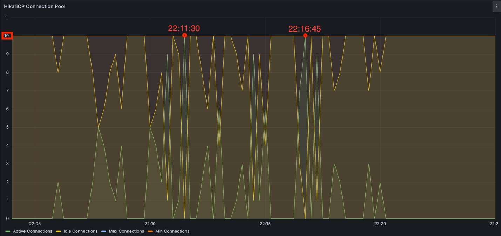

- maximum-pool-size는 기본값인 10이다.
- Active Connections(초록색)이 10인 구간이 '22:11:30', '22:16:45' 두 시점에 관측된다.

**hikaricp-pending-connection-request**
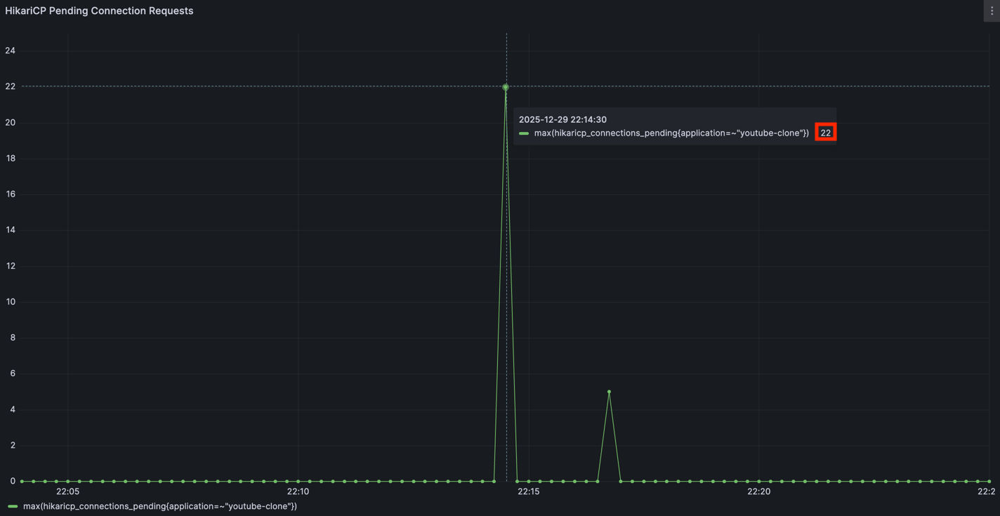

- 커넥션 풀에서 커넥션을 얻기 위해 기다리고 있는 스레드 수는 22개이다.
- 이 시점(22:14:30)에 커넥션 풀의 Active Connections는 9이다.

**HikariCP Acquire Time (p99)**
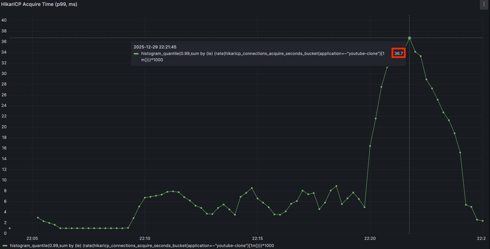

- 커넥션 획득 시도 중 99%는 36.7ms 이내에 커넥션을 획득했다.

---

### 원인 분석

커넥션 풀 지표를 확인한 결과, 특정 시점에 커넥션 대기(pending)가 발생해 커넥션 수요가 풀 용량을 일시적으로 초과한 구간이 존재했다. 이는 보통 쿼리 지연, DB 락 대기, 또는 트랜잭션이 길어져 커넥션 반환이 늦어질 때 나타나는 패턴이다.

**근본 원인**:
- 쿼리 실행 시간이 길어 커넥션 점유 시간 증가
- 폴링 패턴 특성상 특정 순간 수백 개 요청이 동시 도착
- 동시 처리해야 할 요청 수에 비해 커넥션 풀 크기 부족

---

### 해결 방법

DB 커넥션 점유 시간을 줄이기 위해 API 응답 시간을 단축하는 방향으로 개선을 진행한다.

#### 1. 인덱스 최적화

**적용 내용**:
- `subscription` 테이블: 복합 인덱스 `(channel_id, deleted_date)` 추가
- `live_streaming_chat` 테이블: 복합 인덱스 `(live_streaming_id, deleted_date, id)` 추가

**개선 효과**:
- 메타데이터 조회 쿼리: 69.5ms → 16ms (76.8% 개선)
- 채팅 조회 쿼리: 49.6ms → 0.357ms (99.3% 개선)

자세한 쿼리 분석은 [라이브 스트리밍 채팅 조회 쿼리 최적화 문서](./라이브%20스트리밍%20채팅%20조회%20쿼리%20최적화%20-%2049.6ms에서%200.357ms로%20(99.3%25%20개선).md) 참고

#### 2. LiveStreamingChat 테이블 역정규화

**적용 내용**:
- `username`, `profileImageUrl` 컬럼을 `live_streaming_chat` 테이블에 직접 저장
- User 테이블 JOIN 제거

**개선 효과**:
- 채팅 조회 시 User 테이블 조인 제거로 쿼리 실행 시간 단축

#### 3. 쓰기 시점 DB 조회 제거 (채팅 전송 최적화)

**적용 내용**:
- Caffeine 캐시로 LiveStreaming status 캐싱
- `getReferenceBy`로 프록시만 얻어 실제 DB 조회 제거
- 세션 정보를 활용한 User DB 조회 제거

**개선 효과**:
- 채팅 전송 시 SELECT 쿼리 2개 제거 (LiveStreaming, User)
- DB 커넥션 점유 시간 최소화

자세한 구현 상세는 [라이브 스트리밍 채팅 전송 최적화 문서](./라이브%20스트리밍%20채팅%20전송%20최적화%20-%20쓰기%20시%20DB%20조회%202회에서%200회로%20100%25%20제거.md) 참고

---

### 커넥션 풀 크기별 성능 테스트

위 최적화를 적용한 후, 커넥션 풀 크기를 점진적으로 증가시키며 성능 테스트를 진행했다.

#### HikariCP Connection Pool (maximum-pool-size: 20)

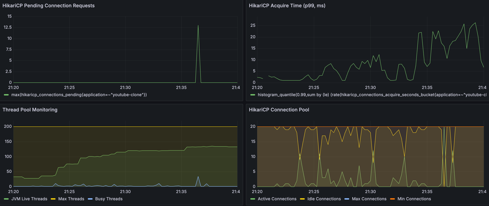

- Active Connections 최대: 20 (포화)
- 커넥션 풀 부족으로 대기 발생

#### HikariCP Connection Pool (maximum-pool-size: 30)

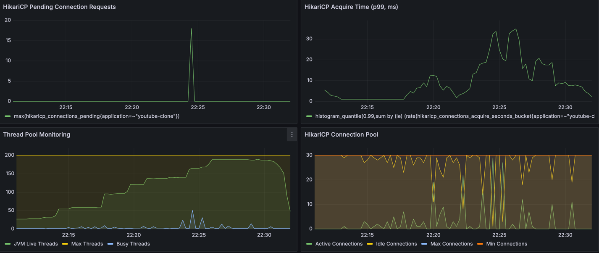

- Active Connections 최대: 30 (포화)
- 커넥션 수요가 풀 용량 초과

#### HikariCP Connection Pool (maximum-pool-size: 40)

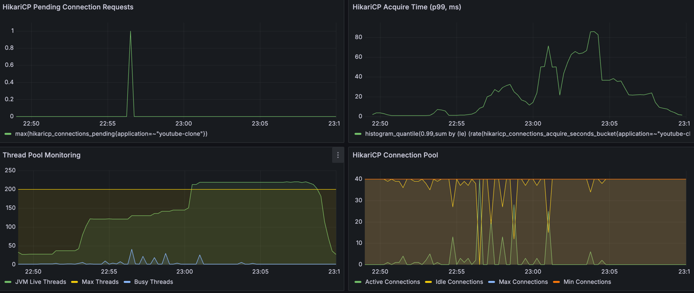

- Active Connections 최대: 40 (포화)
- 여전히 커넥션 부족

#### HikariCP Connection Pool (maximum-pool-size: 50)

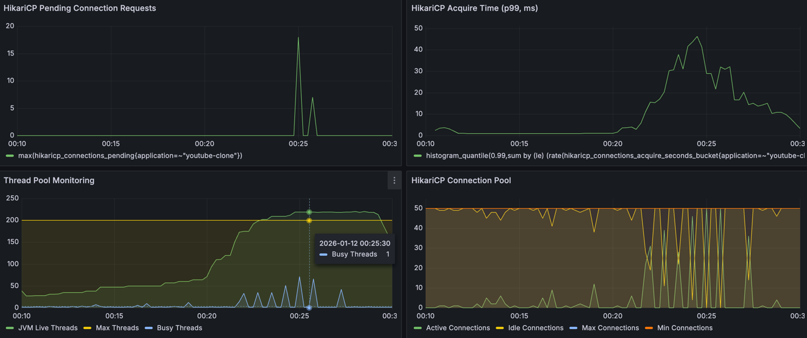

- Active Connections 최대: 50 (포화)
- 여전히 빠듯한 상황

#### HikariCP Connection Pool (maximum-pool-size: 60 - 최종)

**테스트 1**
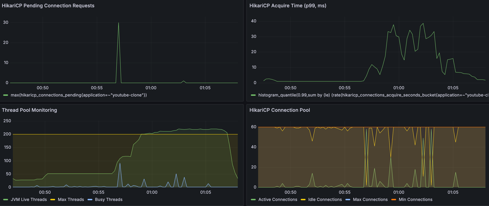

- Active Connections 최대: 58
- 여유율: 3.3% (60개 중 58개 사용)

**테스트 2**
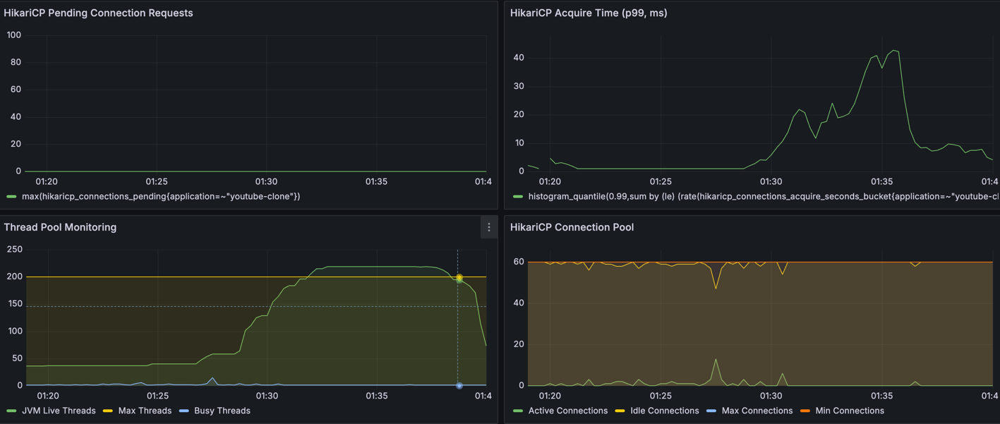

- Active Connections 최대: 13

**테스트 3**

- Active Connections 최대: 13

**결론**: maximum-pool-size 60에서 최초로 커넥션 풀 포화 상태 해소

---

### 결과 및 개선 효과

최적화(인덱스, 역정규화, 쓰기 시점 조회 제거)를 적용하고, 커넥션 풀을 60개로 설정하여 최종 부하 테스트를 진행했습니다.

#### 테스트 결과

**결론부터 말하자면, Max Latency는 완전히 잡히지 않았습니다.**
또한, '새 채팅 폴링' API의 p99 지표가 목표치를 미세하게 초과하여 `KO`가 발생했습니다.

| 측정 항목 | 목표 (p95 / p99) | 개선 후 (p95) | 개선 후 (p99) | 결과 |
|:---:|:---:|:---:|:---:|:---:|
| **메타데이터 조회** | 300ms / 600ms | 108ms | 227ms | ✅ 통과 |
| **초기 채팅 조회** | 500ms / 1000ms | 25ms | 48ms | ✅ 통과 |
| **새 채팅 폴링** | 400ms / 700ms | **120ms** | **708ms** | ⚠️ **실패 (8ms 초과)** |
| **실시간 통계 폴링** | 700ms / 1200ms | 110ms | 820ms | ✅ 통과 |

**주요 데이터 분석:**
*   **Max Latency 3.7초**: 여전히 최대 응답 시간은 3~4초 대에서 튀고 있습니다.
*   **튀는 건 튄다**: 아무리 쿼리를 튜닝해도 1,000명이 동시에 쏘는 폴링 요청이 몰리는 순간, 커넥션 풀 60개로는 순간적인 대기가 발생할 수밖에 없음을 확인했습니다.

---

### 트러블슈팅 회고

이번 성능 개선 프로젝트는 저에게 '성능 테스트의 통과 여부보다 중요한 건 이유를 아는 것'이라는 큰 교훈을 남겼습니다.  
특히 분산 환경을 고려하기 전에 단일 애플리케이션에서 낼 수 있는 극한의 성능을 끌어내는 데 집중했습니다. 

#### 1. 사실, 첫 테스트는 통과했었습니다
아무런 튜닝도 하지 않은 첫 번째 테스트 결과는 All Pass였습니다.
Gatling VUser의 시나리오를 확률적으로 동작하도록 구성하니, 운 좋게 트래픽이 예쁘게 분산되어 들어왔고 모든 지표가 초록색으로 떴습니다.

보통이라면 "어 버티네?" 하고 넘어갔을지도 모릅니다. 하지만 성능테스트 Report에 찍힌 Max: 3~4s 라는 수치가 계속 마음에 걸렸습니다.
"p95/p99는 빠른데, 왜 가끔 3초씩 걸릴까?" 이 찝찝함 때문에 원인을 파기 시작했습니다.

#### 2. 3.7초의 병목, 범인은 DB가 아닌 '대기 시간'이었다
지표들을 분석하던 중, 응답 지연이 발생하는 시점에 HikariCP Connection Pool이 포화 상태에 도달함을 포착했습니다.
단순히 풀 사이즈를 늘리는거나 Scale Out을 하는 것은 당장의 불을 끌 수 있는 쉬운 방법이지만, 단일 서버의 효율을 극대화하지 않은 채 인프라만 늘리는 것은 비효율적인 비용 증가로 이어질 것임을 인지하고 있었습니다.

따라서 저는 무작정 리소스를 늘리기보다, 애플리케이션이 가진 비효율을 제거하는 것이 우선이라는 원칙을 세웠습니다. 기본값인 `maximum-pool-size: 10`에서도 최대한의 성능을 낼 수 있도록 쿼리와 로직을 극한으로 최적화해 보기로 결정했습니다.

그 결과 인덱스와 역정규화를 통해 쿼리 속도를 비약적으로 향상시켰습니다.
아이러니하게도 최적화를 마친 최종 테스트에서는 오히려 실패(KO)가 떴습니다.
하지만 저는 첫 번째 운 좋은 성공보다 이번의 실패가 훨씬 값지다고 생각합니다. 이제는 막연한 운이 아니라 데이터로 상황을 설명할 수 있기 때문입니다.

#### 3. "유튜브는 왜 폴링을 쓸까?"라는 호기심에서 시작된 검증
이 프로젝트의 시작은 작은 호기심이었습니다.
흔히 '실시간 채팅 = WebSocket'이 공식처럼 여겨지지만, 실제 유튜브의 네트워크 탭을 열어봤을 때 주기적으로 API를 호출하는 폴링(Polling) 방식을 사용하고 있었습니다.

"세계 최대의 동영상 서비스가 왜 폴링을 쓸까? 내가 모르는 폴링의 장점이 있거나, 최적화만 잘하면 폴링으로도 충분한 게 아닐까?"

이 궁금증을 해결하기 위해 무작정 WebSocket을 도입하는 대신, 폴링과 WebSocket을 직접 구현하여 성능을 비교해 보기로 했습니다.

이제 단일 애플리케이션 환경에서 폴링 방식의 최대 성능을 확인했으니, 다음 단계에서는 동일한 환경에서 WebSocket을 적용하여 비교 분석해 보겠습니다.

---

### 모니터링 스냅샷 (Grafana)

각 테스트 단계별 Grafana 대시보드 스냅샷입니다. (순서: Spring WAS / JVM / Node Exporter)

#### 1. 초기 테스트 (HikariCP 10)
- [Spring WAS](https://snapshots.raintank.io/dashboard/snapshot/QeFX7Ts09IqNnikVVIFL8jC9mQk7mUd7)
- [JVM](https://snapshots.raintank.io/dashboard/snapshot/0UYTZN8MNpArjXyuCacrGOXeKZDVGVN9)
- [Node Exporter](https://snapshots.raintank.io/dashboard/snapshot/sU8CfR0qBdkdJHjmBVzntIYO8pCJZtJJ)

#### 2. HikariCP 20 확장
- [Spring WAS](https://snapshots.raintank.io/dashboard/snapshot/6JYnqbDJ1T2Xv4umht4BqYZPI0oDqxPV)
- [JVM](https://snapshots.raintank.io/dashboard/snapshot/DXCmP7QdY6iYOTLWxU3qaSdo7piUEzPd)
- [Node Exporter](https://snapshots.raintank.io/dashboard/snapshot/uRKTZNtTI6vIlrdsGVVc1idonj70KABs)

#### 3. HikariCP 30 확장
- [Spring WAS](https://snapshots.raintank.io/dashboard/snapshot/bEKN2MeQrJutAXmPmCsspentp9PGDRSw)
- [JVM](https://snapshots.raintank.io/dashboard/snapshot/qRYiLWMGk5DYjDnIHGv0iN04EEvmCWVj)
- [Node Exporter](https://snapshots.raintank.io/dashboard/snapshot/7lSMrk6TcC76KKbGhdpCfMg2EHBOY603)

#### 4. HikariCP 40 확장
- [Spring WAS](https://snapshots.raintank.io/dashboard/snapshot/4yPCes5Z4BPxUbIXIUGj9ygtm5FlwJLM)
- [JVM](https://snapshots.raintank.io/dashboard/snapshot/eZdpliXTwzU8q8zc7ooSou8GvFsF5X6R)
- [Node Exporter](https://snapshots.raintank.io/dashboard/snapshot/yjbkgPMSKFEppQmDF0zOnXKArEEy6bfk)

#### 5. HikariCP 50 확장
- [Spring WAS](https://snapshots.raintank.io/dashboard/snapshot/wnoo2LpHfrUqsJJfyf1EGHno5uKvT0rL)
- [JVM](https://snapshots.raintank.io/dashboard/snapshot/liUg2NBqQQXWlmk9hz5A7l6WMZcz9OUM)
- [Node Exporter](https://snapshots.raintank.io/dashboard/snapshot/VVJyNiiOVeIQkeVpfEV5K1V4YtUCZ4Pd)

#### 6. HikariCP 60 확장 (1차)
- [Spring WAS](https://snapshots.raintank.io/dashboard/snapshot/oMV3xrDrrCJErBYmJ3XhWgUeK837L1y7)
- [JVM](https://snapshots.raintank.io/dashboard/snapshot/L9cOZvD4FC5TXkD5ZVNAnUCXfbY9iqwq)
- [Node Exporter](https://snapshots.raintank.io/dashboard/snapshot/eP0GoRo14zsX6vyEzIoaEZBrKaqI04mM)

#### 7. HikariCP 60 확장 (2차)
- [Spring WAS](https://snapshots.raintank.io/dashboard/snapshot/D1qIeZiKahX9XjwLWFIORrjn2PRjeku8)
- [JVM](https://snapshots.raintank.io/dashboard/snapshot/y8j40NJrQ1rusJLppSQKHmqXEe25QJC4)
- [Node Exporter](https://snapshots.raintank.io/dashboard/snapshot/vFqxrQN6KOnLm0DFHyPEhc3X2GU2lQ6f)

#### 8. HikariCP 60 확장 (3차 - 최종)
- [Spring WAS](https://snapshots.raintank.io/dashboard/snapshot/Hpt4lpyKpj71oRP62kTbzAVpVtvLJhz9)
- [JVM](https://snapshots.raintank.io/dashboard/snapshot/XI2AWar2AMsoava7BHBt9IhTWrM0rlLQ)
- [Node Exporter](https://snapshots.raintank.io/dashboard/snapshot/ccsCtJze40QDGbqPuVo3xruvHuKBVbr4)
