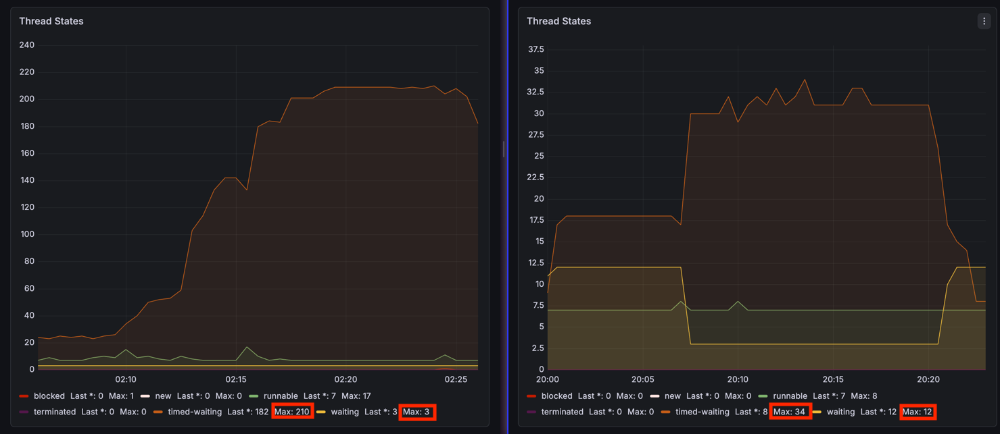
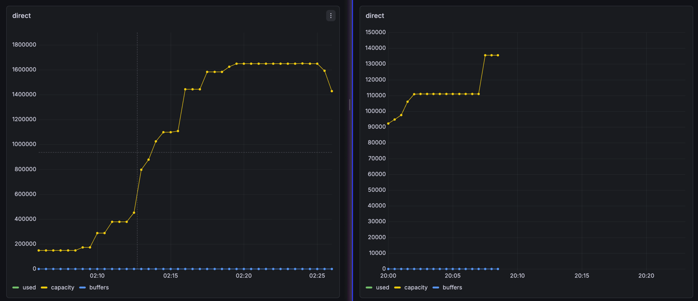
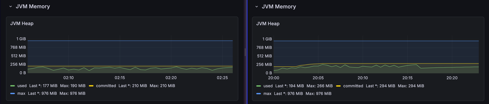
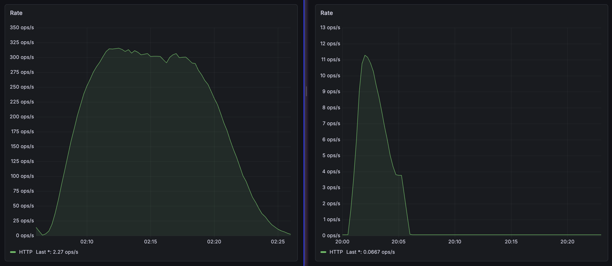

# 라이브 스트리밍 채팅 - Polling vs WebSocket 모니터링 지표 비교 분석

## 개요

**분석 배경**: 실제 유튜브의 라이브 스트리밍 채팅은 HTTP Polling 방식으로 구현되어 있습니다. 유튜브 클론 프로젝트에서는 Polling과 WebSocket 두 방식으로 구현하여 어떤 차이를 보이는지 분석했습니다.

**테스트 목적**: 동일한 성능 테스트 조건에서 HTTP Polling과 WebSocket의 특성을 비교하고, 각 방식의 리소스 사용 패턴과 트레이드오프를 데이터로 확인합니다.

**테스트 설계**: 1,000명의 동시 접속자(VUser)가 라이브 스트리밍 채팅에 참여하는 동일한 시나리오에서, 통신 방식만 각각 HTTP Polling과 WebSocket으로 변경하여 서버의 핵심 성능 지표를 측정했습니다.

**분석 범위와 한계**: 본 문서는 Prometheus와 Grafana를 통해 수집한 모니터링 지표(JVM 메트릭, Node Exporter 메트릭)를 기반으로 작성되었습니다. 로우레벨 분석은 수행하지 않았으며, 프레임워크 내부 동작에 대한 설명은 공식 문서와 측정된 지표를 바탕으로 추론한 내용입니다.

### 테스트 환경

| 항목 | 상세 |
|------|------|
| **부하 생성** | Gatling (1,000 VUsers) |
| **폴링 주기** | 짧은 폴링: 4초, 긴 폴링: 20초 |
| **기술 스택** | Spring MVC, Spring STOMP |
| **모니터링** | Prometheus + Grafana (JVM 메트릭, Node Exporter 메트릭) |

### 핵심 비교 지표 

> **두 방식의 정량적 차이**:
> - **스레드 사용량**: Polling 최대 210개 vs WebSocket 최대 34개 (84% 차이)
> - **Direct Buffer 메모리** (Off-Heap): Polling 약 1.6MB vs WebSocket 약 110KB
> - **JVM Heap 메모리**: Polling 최대 190 MiB vs WebSocket 최대 266 MiB
> - **프로토콜 오버헤드**: Polling은 지속적 HTTP RPS 발생, WebSocket은 초기 핸드셰이크 이후 0에 수렴

---

## 1. JVM Thread States

*(좌: Polling, 우: WebSocket)*

### 관찰

-   **Polling**: `TIMED_WAITING` 상태의 스레드가 최대 210개이며, 시나리오의 VUser가 증가함에 따라 `TIMED_WAITING` 상태의 스레드가 증가
-   **WebSocket**: `TIMED_WAITING` 스레드 최대 34개로, Polling에 비해 적은 스레드 개수로 안정적으로 유지

### 분석

#### Polling - 스레드 풀 고갈과 동기적 블로킹

Tomcat의 스레드 풀 기반 요청 처리 모델에서, 1,000명의 유저가 4~20초마다 HTTP 요청을 보내면 서버는 가용 스레드를 한계까지 사용하게 됩니다.

높은 `TIMED_WAITING` 수치는 각 스레드가 동기적 I/O 작업(DB 조회)에서 블로킹되고 있습니다. Tomcat이 NIO 커넥터를 사용하더라도, Spring MVC는 각 요청을 워커 스레드에 할당하여 처리하며, [해당 스레드 내에서 DB 접근과 같은 블로킹 I/O가 발생하면 스레드는 대기 상태](https://docs.spring.io/spring-framework/reference/web/webflux/new-framework.html#webflux-framework-choice)에 머물게 됩니다.

#### WebSocket - 영구 연결과 이벤트 기반 메시지 처리

Spring STOMP은 메시징 프로토콜과 WebSocket 인프라를 결합하며, [스레드 풀 기반 비동기 메시지 처리](https://docs.spring.io/spring-framework/reference/web/websocket/stomp/configuration-performance.html)를 사용합니다.

**Polling과의 근본적 차이**:
- **Polling (Spring MVC)**: 각 HTTP 요청마다 워커 스레드 1개를 할당하며, [요청 처리가 완료될 때까지 해당 스레드를 점유](https://docs.spring.io/spring-framework/reference/web/webflux/new-framework.html#webflux-framework-choice)
- **WebSocket (Spring STOMP)**: 영구 TCP 연결 자체는 스레드를 소비하지 않으며, 메시지가 도착했을 때만 스레드 풀에서 스레드를 빌려 처리 후 즉시 반환

**스레드 풀 기반 아키텍처**:
-   **영구 연결 유지**: 초기 WebSocket 핸드셰이크 이후 TCP 연결이 지속되며, 유휴 연결은 최소 리소스만 소비합니다
-   **메시지 브로커 패턴**: SimpleBroker가 구독 정보를 메모리에서 관리하며, 메시지 도착 시 브로드캐스트 방식으로 동작합니다
-   **스레드 풀 기반 메시지 처리**: 내부 스레드 풀(`clientInboundChannel`, `clientOutboundChannel`)은 [기본적으로 프로세서 수의 2배로 설정](https://docs.spring.io/spring-framework/reference/web/websocket/stomp/configuration-performance.html)되며, 메시지 처리 시에만 스레드를 할당합니다. 적은 수의 스레드로 처리 가능합니다

**측정 결과의 의미**: 연결 수가 1,000개로 늘어나도 스레드 사용량이 34개 수준으로 유지되는 것은, 연결당 스레드를 할당하지 않고 메시지 처리 시에만 스레드 풀을 사용하기 때문입니다. 이는 Polling 방식의 210개 스레드(84% 차이)와 비교했을 때 극적인 리소스 효율성을 보여줍니다.

---

## 2. Buffer Pools

*(좌: Polling, 우: WebSocket)*

> **Note**: Direct Buffer는 JVM Heap 외부의 네이티브 메모리(Off-Heap)에 할당되어, OS 레벨 I/O 작업 시 데이터 복사 오버헤드를 최소화합니다. 이 섹션의 메모리는 JVM Heap과 별도로 측정됩니다.

> 그래프의 capacity와 used는 동일한 수치를 가지며 겹쳐있으므로 used가 보이지 않음

### 관찰

-   **Polling**: Direct Buffer가 계단식으로 증가하며 최대 약 1.6MB 사용 (그래프 세로축 1,600,000 bytes)
-   **WebSocket**: 초기 약 110KB 수준에서 평탄하게 유지 (그래프 세로축 110,000 bytes)

### 분석

#### Polling - 짧은 연결 생명주기와 반복적 버퍼 할당

Tomcat의 HTTP 요청-응답 모델에서, 각 요청마다 연결을 처리하고 완료 후 종료하는 짧은 생명주기를 가집니다.

계단식 패턴은 동시 연결 수 증가에 따라 버퍼 풀이 지속적으로 확장되고 있음을 보여줍니다. [Java NIO를 사용하여 소켓 통신을 처리할 때 일반적으로 각 연결마다 ByteBuffer를 할당](https://mark-kim.blog/understanding-non-blocking-io-and-nio/)합니다.

#### WebSocket - 영구 연결과 버퍼 재사용

Spring MVC는 [Tomcat NIO Connector의 Poller가 소켓을 캐시로 유지](https://velog.io/@jihoson94/BIO-NIO-Connector-in-Tomcat)하며 영구 연결을 관리합니다.

**Polling과의 근본적 차이**:
- **Polling (Spring MVC)**: 연결이 요청 완료 후 종료되는 짧은 생명주기로, 계단식 증가 패턴을 보아 버퍼 할당/해제가 반복되는 것일 수 있음
- **WebSocket (Spring STOMP)**: Poller가 연결을 캐시로 유지하는 영구 연결로, 평탄한 패턴을 보아 한 번 할당된 버퍼를 재사용하는 것으로 추정됨

**효율적인 버퍼 관리 특징**:
-   **영구 연결 유지**: 초기 WebSocket 핸드셰이크 이후 TCP 연결이 지속되며, HTTP 헤더 같은 프로토콜 오버헤드 없이 메시지만 교환
-   **버퍼 재사용 패턴**: 평탄한 메모리 사용 패턴을 보아, [NIO 방식에서 일반적으로 사용되는 Direct Buffer 재사용](https://mark-kim.blog/understanding-non-blocking-io-and-nio/) 방식을 활용하는 것으로 보임
-   **효율적인 메모리 관리**: [Direct Buffer는 커널 메모리를 직접 참조](https://mark-kim.blog/understanding-non-blocking-io-and-nio/)하여 복사 오버헤드를 줄임

**측정 결과의 의미**: Polling의 1.6MB (계단식 증가)는 동시 연결 수 증가에 따라 버퍼 할당이 누적되는 패턴으로 보이며, 이는 요청 처리를 위한 ByteBuffer가 트래픽 피크 시 최대치까지 증가함을 의미합니다. 반면 WebSocket의 110KB (평탄 유지)는 연결 수가 증가해도 메모리 사용량이 일정하게 유지되는 것으로 보아, 영구 연결 방식에서 버퍼를 효율적으로 재사용하는 것으로 추정되며, Polling 대비 약 93% 적은 Off-Heap 메모리 사용을 달성합니다.

---

## 3. JVM Heap Memory

*(좌: Polling, 우: WebSocket)*

> **Note**: JVM Heap 영역은 애플리케이션 객체(세션, 요청/응답 객체, 비즈니스 로직 등)가 할당되며 GC의 대상이 됩니다. 앞서 본 Direct Buffer(Off-Heap)와는 다른 메모리 영역입니다.

### 관찰

-   **Polling**: 
    -   used 최대 190 MiB
    -   100~190 MiB 사이 반복
    
-   **WebSocket**:
    -   used 최대 266 MiB
    -   100~270 MiB 사이 반복

### 분석

#### Polling

각 HTTP 요청마다 짧은 생명주기 객체가 생성되고 소멸되는 과정을 반영하는 것으로 보입니다:

**특징**: 
- 웹소켓과 비교하여 비교적 낮은 메모리 사용량 (최대 190 MiB)

#### WebSocket

초기 메모리 증가는 1,000개 WebSocket 세션에 필요한 객체가 Heap에 할당되는 과정으로 보입니다:

-   한 번 할당된 객체가 연결 유지 동안 상주하여 램프업 후 추가 할당이 거의 발생하지 않습니다
-   더 높은 베이스라인(+84 MiB)은 영구 연결 유지 방식의 트레이드오프로 볼 수 있습니다

---

## 4. RPS (Requests per Second)

*(좌: Polling, 우: WebSocket)*

### 관찰

-   **Polling**: 테스트 전반에 걸쳐 지속적으로 높은 RPS 발생
-   **WebSocket**: 최초 핸드셰이크 이후 RPS ≈ 0 (HTTP 요청 없음)

### 분석

#### Polling

-   1,000명이 4~20초마다 폴링 시, 서버는 초당 수백 건의 요청-응답 사이클 처리 필요

#### WebSocket

-   최초 HTTP 업그레이드 핸드셰이크 이후 TCP 연결 지속 유지하여 모든 데이터는 HTTP 형식이 아닌 가벼운 메시지 프레임으로 교환
-   RPS ≈ 0은 HTTP 요청이 발생하지 않음을 의미 (정상 동작)

---

## 결론: 두 방식의 성능 특성 비교

### 정량적 비교 결과

4가지 핵심 지표를 통해 측정한 두 방식의 성능 차이는 다음과 같습니다:

| 지표 | Polling | WebSocket | 차이 |
|------|---------|-----------|------|
| **스레드 사용** | 최대 210개 | 최대 34개 | 84% 차이 |
| **Off-Heap 메모리** | 약 1.6MB | 약 150KB | 약 91% 차이 |
| **JVM Heap** | 190 MiB | 266 MiB | +76 MiB (WebSocket 더 높음) |
| **프로토콜 오버헤드** | 지속적 HTTP RPS | 0에 수렴 | HTTP 요청 제거 |

### 각 방식의 트레이드오프

#### Polling의 장단점

**장점**:
- 구현이 단순하고 기존 HTTP 인프라 재사용 가능
- 비교적 낮은 Heap 메모리 사용량 (최대 190 MiB)
- 방화벽/프록시 호환성이 높음
- 짧은 세션에 유리 (핸드셰이크 오버헤드 없음)
- 디버깅과 모니터링 용이 (표준 HTTP 툴 사용 가능)

**단점**:
- 높은 스레드 소비
- 무관한 주기적 요청 발생
- Off-Heap 버퍼 풀 증가 패턴 (최대 약 1.6MB)

#### WebSocket의 장단점

**장점**:
- 낮은 스레드 사용량
- 프로토콜 오버헤드 최소화
- 낮은 Off-Heap 메모리 사용량 (약 150KB)

**단점**:
- 더 높은 Heap 메모리 요구량 (+84 MiB, 약 40%)
- 구현 복잡도가 높음
- 일부 기업 환경에서 방화벽 이슈 가능
- 짧은 세션에는 비효율적 (핸드셰이크 오버헤드)
- 디버깅 난이도가 상대적으로 높음

### 실무적 고찰

**유튜브가 Polling을 사용하는 이유**: 
- 글로벌 규모의 CDN과 인프라를 보유한 유튜브는 Polling의 단점(높은 리소스 사용)을 인프라 스케일로 해결할 수 있으며, 구현 단순성과 호환성을 우선시했을 가능성이 있습니다. 
- 이 때문에 방화벽 내부의 사내/내부용 애플리케이션에서는 WebSocket 채택이 비교적 명확한 결정일 수 있지만, 공개 서비스에서는 더 신중한 판단이 필요합니다.

---

## References

1. [Spring Framework - WebSocket & STOMP](https://docs.spring.io/spring-framework/reference/web/websocket/stomp.html)  

2. [Spring Framework - WebSockets](https://docs.spring.io/spring-framework/reference/web/websocket.html)  

3. [Spring Framework - WebSocket Fallback](https://docs.spring.io/spring-framework/reference/web/websocket/fallback.html)  

4. [Spring Framework - Concurrency Model](https://docs.spring.io/spring-framework/reference/web/webflux/new-framework.html#webflux-framework-choice)  

5. [Spring Framework - STOMP Performance](https://docs.spring.io/spring-framework/reference/web/websocket/stomp/configuration-performance.html)  

6. [Java NIO ByteBuffer](https://docs.oracle.com/en/java/javase/17/docs/api/java.base/java/nio/ByteBuffer.html)  

7. [사례를 통해 이해하는 네트워크 논블로킹 I/O와 Java NIO (참고 자료)](https://mark-kim.blog/understanding-non-blocking-io-and-nio/)  

8.  [BIO, NIO Connector Architecture in Tomcat (참고 자료)](https://velog.io/@jihoson94/BIO-NIO-Connector-in-Tomcat)  

---

## 관련 문서
- [p99는 안정적인데 Max만 튀는 현상 - JVM, GC, HikariCP 모니터링을 통한 병목 해결](https://github.com/youtube-clone-pj/youtube-clone-backend/blob/main/issue-solution-docs/loadtest-live-polling/p99%EB%8A%94%20%EC%95%88%EC%A0%95%EC%A0%81%EC%9D%B8%EB%8D%B0%20Max%EB%A7%8C%20%ED%8A%80%EB%8A%94%20%ED%98%84%EC%83%81%20-%20JVM%2C%20GC%2C%20HikariCP%20%EB%AA%A8%EB%8B%88%ED%84%B0%EB%A7%81%EC%9D%84%20%ED%86%B5%ED%95%9C%20%EB%B3%91%EB%AA%A9%20%ED%95%B4%EA%B2%B0.md)  

---

### 모니터링 스냅샷 (Grafana)

#### Polling
- [Spring WAS](https://snapshots.raintank.io/dashboard/snapshot/Hpt4lpyKpj71oRP62kTbzAVpVtvLJhz9)
- [JVM](https://snapshots.raintank.io/dashboard/snapshot/XI2AWar2AMsoava7BHBt9IhTWrM0rlLQ)
- [Node Exporter](https://snapshots.raintank.io/dashboard/snapshot/ccsCtJze40QDGbqPuVo3xruvHuKBVbr4)

#### WebSocket
- [Spring WAS](https://snapshots.raintank.io/dashboard/snapshot/mxQWLsV56zBA9hpaVddMY19iSFqWRLvM)
- [JVM](https://snapshots.raintank.io/dashboard/snapshot/5negsxFvmES3F2kHa2azRtB9oVY6c3zL)
- [Node Exporter](https://snapshots.raintank.io/dashboard/snapshot/KlEmh7TCTF65pw67KhRrGCLVECFE543E)
